Youtube analysis on ‘Bangladesh’
================
Arafath Hossain
June 27, 2018

  - [Part 01: Background about this
    project](#part-01-background-about-this-project)
  - [Part 02: Data collection](#part-02-data-collection)
  - [Part 03: Data cleaning](#part-03-data-cleaning)
  - [Part 04: Data analysis](#part-04-data-analysis)
  - [Part 05: Ending](#part-05-ending)

## Part 01: Background about this project

This analysis is part of an ongoing exploratory study about the contents
related to [Bangladesh](https://en.wikipedia.org/wiki/Bangladesh) in
different online social media platforms. In the last
[article](https://rpubs.com/arafath/twitter_analysis) tweets that
containing *Bangladesh* were analyzed to understand the most common
areas that people tweeted about Bangladesh and how public sentiments
were reflected. In this article a similar study will be conducted on the
videos shared on Youtube that have *Bangladesh* in their titles. To
collect the data YouTube’s publicly available API will be used. Along
with the video stats, comments posted by viewers will also be fetched
and analyzed.

The analysis is segmented broadly into two phases:

1.  Extracting insights from the overall statistics of the videos and
2.  Extracting insights from the unstructured data (e.g. comments) by
    applying different text analytics techniques.

Some of the key goals of this analysis are to see:

  - What kind of videos are posted?
  - Is there any trend in the number of video posted with the time when
    they are posted?
  - What kind of videos are mostly liked and disliked?
  - Which videos get most traction with their viewers?
  - Videos around which topics are mostly posted?
  - Do the trend of video posting vary based on different types of
    videos?
  - How do people react or express their sentiment in the comment
    section?
  - Do sentiment change over the time?

## Part 02: Data collection

The required data for this analysis has been scraped using public API
provided by YouTube. Time line considered is the whole year (2017-2018).
Scraping YouTube produced a pool of 585 unique videos which have
*Bangladesh* mentioned in their titles. These videos were posted from
total 377 different channels. An easy to follow step by step process of
how to connect with YouTube using **tuber** package can be found in this
link: <https://www.youtube.com/watch?v=NEh5N3OZCXc> and the codes used
to scrape data for this project can be seen by un-hiding the following
code chunk.

``` r
# credentials 
app_id = 'Your_app_id'
app_secret = 'your_app_secret'
# establishing connecting with YouTube
yt_oauth(app_id = app_id, app_secret = app_secret)

# ---fetching YouTube videos with 'bangladesh' in the title---
# searching for videos that have 'Bangladesh' in the title
videos_year <- yt_search("Bangladesh", published_after = "2017-6-01T00:00:00Z", published_before = "2018-1-1T00:00:00Z")
# fetching video statistics for all videos (2017-2018)
videostats = lapply(as.character(videos_year$video_id), function(x){
  get_stats(video_id = x)
})
df = ldply(videostats, data.frame)

# merging videos stats with the main file:  videos_year
colnames(df)[1] = 'video_id' # renaming 'id' as video_id so that it matches same coluimn in main table
videos_year = videos_year %>% left_join(df, by = 'video_id')

# correcting data type
videos_year[,c('viewCount', 'likeCount', 'dislikeCount', 'favoriteCount', 'commentCount')]=apply(videos_year[,c('viewCount', 'likeCount', 'dislikeCount', 'favoriteCount', 'commentCount')],2,as.numeric)
# write.csv(videos_year,'youtube_video_raw+stat_2017-2018.csv', row.names = FALSE)
```

## Part 03: Data cleaning

In the last part we have collected video specific statistics and
compiled all in a single file named **videos\_year**. A look into the
file reveals that it contains 589 observations/rows and 21
variables/columns. Or in other words we have 21 different attributes
collected for each of the videos. To look at the variables some basic
summary codes have been run and the results are shown below:

``` r
videos_year = read.csv('Data/youtube_video_raw+stat_2017-2018.csv')
dim(videos_year)
```

    ## [1] 589  21

``` r
names(videos_year)
```

    ##  [1] "video_id"                  "publishedAt"              
    ##  [3] "channelId"                 "title"                    
    ##  [5] "description"               "thumbnails.default.url"   
    ##  [7] "thumbnails.default.width"  "thumbnails.default.height"
    ##  [9] "thumbnails.medium.url"     "thumbnails.medium.width"  
    ## [11] "thumbnails.medium.height"  "thumbnails.high.url"      
    ## [13] "thumbnails.high.width"     "thumbnails.high.height"   
    ## [15] "channelTitle"              "liveBroadcastContent"     
    ## [17] "viewCount"                 "likeCount"                
    ## [19] "dislikeCount"              "favoriteCount"            
    ## [21] "commentCount"

From the variable names we can see that there are data (e.g. thumbnails
related data) that are out of scope of this analysis. We can take a look
at the summary statistics of the other variables to have an idea about
the necessary data cleaning.

``` r
str(videos_year[c('publishedAt','channelId','title','description','channelTitle',
                  'liveBroadcastContent','viewCount','likeCount','dislikeCount', 'favoriteCount','commentCount')])
```

    ## 'data.frame':    589 obs. of  11 variables:
    ##  $ publishedAt         : chr  "2017-07-27T22:21:56.000Z" "2017-10-27T15:37:33.000Z" "2017-11-22T14:59:50.000Z" "2017-07-04T06:18:32.000Z" ...
    ##  $ channelId           : chr  "UCNye-wNBqNL5ZzHSJj3l8Bg" "UCXulruMI7BHj3kGyosNa0jA" "UCXulruMI7BHj3kGyosNa0jA" "UCqlc8Q5Rixjp_zTePTI_mRg" ...
    ##  $ title               : chr  "<f0><U+009F><U+0087><U+00A7><f0><U+009F><U+0087><U+00A9> Bangladesh's Biggest Brothel | 101 East | <U+092C><U+0"| __truncated__ "HELLO BANGLADESH. DHAKA IS CRAZY." "HOW EXPENSIVE IS BANGLADESH? <f0><U+009F><U+0092><U+00B0><f0><U+009F><U+0087><U+00A7><f0><U+009F><U+0087><U+00A9>" "Bangladesh Biman With  CG For Sefty" ...
    ##  $ description         : chr  "The biggest brothel in Bangladesh - and possibly the world. The town of Daulatdia is home to 1500 prostitutes, "| __truncated__ "VLOG #146. Let me know your thoughts in the comments section PATREON: https://www.patreon.com/indigotraveller o"| __truncated__ "INSTAGRAM - https://www.goo.gl/hvrnHZ FACEBOOK - https://www.goo.gl/98tqkZ VLOG #156. Let me know your thoughts"| __truncated__ "" ...
    ##  $ channelTitle        : chr  "Al Jazeera English" "Indigo Traveller" "Indigo Traveller" "Bhaishob Media" ...
    ##  $ liveBroadcastContent: chr  "none" "none" "none" "none" ...
    ##  $ viewCount           : int  10456088 297082 400570 2867726 1098161 745213 901613 586726 17040399 249231 ...
    ##  $ likeCount           : int  21569 6862 12307 13686 7964 16885 6824 2551 67524 2696 ...
    ##  $ dislikeCount        : int  5862 463 361 1553 732 521 747 560 10818 482 ...
    ##  $ favoriteCount       : int  0 0 0 0 0 0 0 0 0 0 ...
    ##  $ commentCount        : int  5478 3530 3446 432 342 4243 2024 133 2978 392 ...

Looking at summary stat of other variabes we can identify these issues:
1. Variable *publishedA*’ contains date data in a wrong format. Which
needs to be changed into date format for convenience of future analysis.
2. Variables containing text data ( *title* and *description*) need text
cleaning since they have HTML codes which don’t have any value in terms
of generating meaningful insight In the next three code chunks, these
two issues will be fixed.

``` r
# converting into data type 'date'
videos_year$publishedAt = as.Date(videos_year$publishedAt)
str(videos_year$publishedAt)
```

    ##  Date[1:589], format: "2017-07-27" "2017-10-27" "2017-11-22" "2017-07-04" "2017-08-24" ...

``` r
# creating new variables 'year' and 'month'
videos_year = videos_year %>% mutate(month = month(publishedAt)) %>% mutate(year = year(publishedAt))
```

From above results we can see that data type of variabled named
*publishedAt* has been converted to ‘date’. Two new variables named
*year* and *month* have been created from the *publishedAt* variable to
use in future analysis. Now we will move on to cleaning the text values
in *title* variable.

``` r
head(videos_year$title,5)
```

    ## [1] "<f0><U+009F><U+0087><U+00A7><f0><U+009F><U+0087><U+00A9> Bangladesh's Biggest Brothel | 101 East | <U+092C><U+093E><U+0902><U+0917><U+094D><U+0932><U+093E><U+0926><U+0947><U+0936> <U+0915><U+0940> <U+0938><U+092C><U+0938><U+0947> <U+092C><U+0921><U+093C><U+0940> <U+0935><U+0947><U+0936><U+094D><U+092F><U+093E><U+0932><U+092F>"
    ## [2] "HELLO BANGLADESH. DHAKA IS CRAZY."                                                                                                                                                                                                                                                                                                      
    ## [3] "HOW EXPENSIVE IS BANGLADESH? <f0><U+009F><U+0092><U+00B0><f0><U+009F><U+0087><U+00A7><f0><U+009F><U+0087><U+00A9>"                                                                                                                                                                                                                      
    ## [4] "Bangladesh Biman With  CG For Sefty"                                                                                                                                                                                                                                                                                                    
    ## [5] "Bangladesh Beats West Indies all out for 61 runs (Lowest Score ever)"

The first 10 titles shown above show the uncleaned raw labels or video
titles that exist now in the dataset. And the 5 titles shown below are
the cleaned titles after cleaning the raw titles using different regular
expressions.

``` r
# cleaning video titles
videos_year$title= gsub("<.*?>","", videos_year$title) #removing html tags
videos_year$title= gsub("[[:punct:]]", " ", videos_year$title) #removing html tags
videos_year$title = gsub("[ |\t]{2,}", " ", videos_year$title)  # Remove tabs
videos_year$title = gsub("^ ", "", videos_year$title)  # Leading blanks
videos_year$title = gsub(" $", "", videos_year$title)  # Lagging blanks
videos_year$title = gsub(" +", " ", videos_year$title) # General spaces 
videos_year$title = tolower(videos_year$title) # lowering all letters
head(videos_year$title,5)
```

    ## [1] "bangladesh s biggest brothel 101 east"                             
    ## [2] "hello bangladesh dhaka is crazy"                                   
    ## [3] "how expensive is bangladesh"                                       
    ## [4] "bangladesh biman with cg for sefty"                                
    ## [5] "bangladesh beats west indies all out for 61 runs lowest score ever"

At this stage, before enterign into the data analysis we’ll create three
more variables that contain the ratios of likes, dislikes and comments
against the total views of respective video. Having this ratios will
help us in future to extract insights without bias by considering ratios
rather than the absolute numbers.

``` r
# creating like, dislike, comment ratio
videos_year = videos_year %>%
  mutate(like_ratio = likeCount/viewCount) %>% 
  mutate(dislike_ratio = dislikeCount/viewCount) %>%
  mutate(comment_ratio = commentCount/viewCount) %>% 
  mutate(ratio_to_total = viewCount/sum(viewCount, na.rm = TRUE))

# names(videos_year)
```

## Part 04: Data analysis

To start off, we can look at some basic statistics such as monthly video
posting frequency, most viewed, liked, disliked and commented videos and
so on.

``` r
#month wise video posting (data = videos_year)
videos_year %>%
  group_by(factor(month)) %>%
  mutate(total = n()) %>%
  ungroup() %>%
  ggplot(aes(x = month, y = total)) + 
  geom_line(color = "#27408b") + 
  geom_point(shape=21,fill="white",color="#27408b",size=3,stroke=1.1) + 
  scale_x_continuous(breaks = seq(1,12,1), labels = c("Jan","Feb","Mar","Apr","May",
                                                      "Jun","Jul","Aug","Sep","Oct",
                                                      "Nov","Dec")) +
  labs(x="Month",y="Number of videos",
       title="Month wise frequency of video posting",
       subtitle="subtitle = 'Year 2017 to 2018'")
```

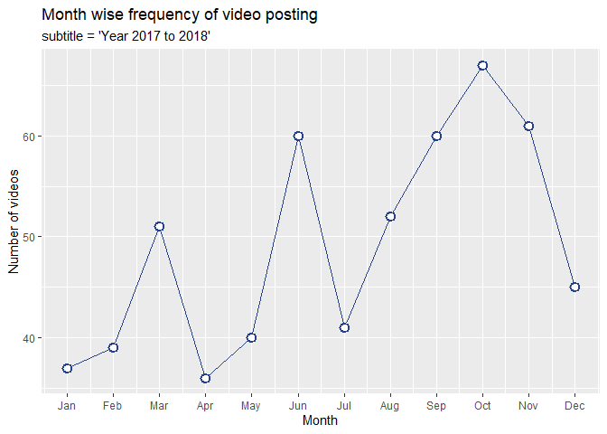<!-- -->

From above chart we can see that there was a growing trend starting from
August which reached at its peak in October and then again gradually
fell. Other than August the other two months with unusual spikes are
March and June. Now let’s look at the most viewed videos and also see in
which month they were posted.

``` r
# most viewed videos
videos_year %>% arrange(desc(viewCount)) %>% head(20) %>%
  mutate(title = strtrim(title, 25)) %>%
  mutate(title = reorder(title,viewCount)) %>% top_n(20) %>% 
  ggplot(aes(as.factor(title), (viewCount/1000000), fill = factor(month))) + 
  geom_col()  + 
  scale_x_discrete() +
  coord_flip() +
  ggtitle(label = 'Top 20 most viewed videos') + 
  xlab(label = 'Video title') + 
  ylab(label = 'Number of views (in millions)') +
  labs(fill = 'Month', caption = '* Video titles have been truncated')
```

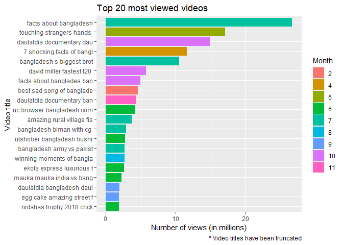<!-- -->

From the abundance of paste and green color in the above plot we can
immediately tell that most of the most viewed viewed videos were posted
during the month of June and July. In addition to that some other
observations can also be made from this plot:

  - There is a wide dispersion among the videos in terms of count
    ofviews. The highest viewed video has a quite a large gap from the
    second most viewed video. And a similar gap is observed between the
    other videos too. Which means the ratio variables created earlier
    during data cleaning and feature engineering stage will come handy
    in further analysis by helping us overcome the imbalance in the
    absolute numbers.
  - Similar to what we have seen during the analysis of tweets regarding
    Bangladesh, there are multiple videos related to Cricket in this
    list of top 20 most viewed videos.
  - But unlike the last analysis there are multiple videos, including
    two out of the top five, about brothel in Bangladesh. To understand
    the reason a manual inspection of the related videos reveals that
    all the three videos in the top 20 videos are about a specific
    brothel situated in a small town called *Doulatdia* in the southern
    part of Bangladesh. But why would that brothel be a center of
    attraction for YouTubes? The answer can be found from a closer look
    at the top three viewed videos.
    [Aljazeera](https://www.aljazeera.com/), a middle eastern news
    channel published a documentary in June, which is the fifth most
    viewed video on this brothel. The rest of the two videos were posted
    from another channel with no credible record like Aljazeera.

So what are the other videos about? We already have got a basic
understanding on what the top viewed videos were about. Now to have a
deeper understanding about the common discussion areas of all the
videos, we will use different key word extraction techniques for this
purpose.

As a first step, let’s transform our text data into a matrix, more
precisely a ‘Document Term Matrix’. Where each word in the text corpus
is separated and columns are created for each of these words. Then each
sentence is plotted as a row and the columns containing words that are
in each docs/sentece get a score of 1 and others 0. Which eventually
creates a sparse matrix with lots of zeros. In our case the sparsity is
really high (very close to 100%) meaning that there are lots of zeros or
in other words there is a wide variety in the titles of the videos.

``` r
videos_year$title = removeWords(as.character(videos_year$title), stopwords('english'))
videos_year_title <- enc2utf8(videos_year$title)
corpus = Corpus(VectorSource(videos_year_title))

dtm = DocumentTermMatrix(corpus)
dtm
```

    ## <<DocumentTermMatrix (documents: 589, terms: 1552)>>
    ## Non-/sparse entries: 3715/910413
    ## Sparsity           : 100%
    ## Maximal term length: 23
    ## Weighting          : term frequency (tf)

``` r
doc.length = apply(dtm, 1, sum)
dtm = dtm[doc.length > 0,]
inspect(dtm[10:11,])
```

    ## <<DocumentTermMatrix (documents: 2, terms: 1552)>>
    ## Non-/sparse entries: 13/3091
    ## Sparsity           : 100%
    ## Maximal term length: 23
    ## Weighting          : term frequency (tf)
    ## Sample             :
    ##     Terms
    ## Docs aprilia bangladesh bikes border dhaka eskaton expensive ktm new road
    ##   10       1          1     1      0     1       1         1   1   1    1
    ##   11       0          1     0      1     0       0         0   0   0    0

From above we can see a summary of our document term matrix. Which shows
sparsity of 100% (which should be very close to 100 not exactly 100). We
can take a look at some of the sentences in from the matrix. Above 10th
and 11th sentences have been fetched as example. We can see that 10th
sentence contains all the words except ‘border’ while 11th sentence
contains only two words ‘bangladesh’ and ‘border’ from the columns that
were fetched as an example.

Now let’s take a look at the most frequently used words.

``` r
freq = colSums(as.matrix(dtm))
length(freq)
```

    ## [1] 1552

``` r
ord = order(freq, decreasing = TRUE)
freq[head(ord, n = 20)]
```

    ##  bangladesh        2017       dhaka       india         top     company 
    ##         614         106          45          44          39          39 
    ##    skydance       dance    rohingya performance     wedding       match 
    ##          38          36          34          32          30          29 
    ##       world         new      bangla        army     myanmar        news 
    ##          25          23          19          19          18          17 
    ##       price       video 
    ##          15          14

Bangladesh and 2017 are the top two most frequent words for obvious
reason. The third most frequent word is Dhaka, the capital of
Bangladesh. Interestingly we see a similar trend here as we have seen in
the our last analysis about tweets, there are quite an interest about
the neighboring countries. In this case we see videos that have mentions
of India and Myanmar. Also we see *rohingya* is one of the most frequent
words here too. There is a seemingly unusual prevalence of dance related
words can be observed among the most frequent words. Looking at the
words correlation may give us a better understanding.

``` r
#library 'tibble' provides the rowname_to_columns to name row names column
df1=as.data.frame(findAssocs(dtm,'rohingya',.24)) %>% rownames_to_column("words")
df2=as.data.frame(findAssocs(dtm,'dhaka',.24)) %>% rownames_to_column("words")
df3=as.data.frame(findAssocs(dtm,'dance',.30)) %>% rownames_to_column("words")
df4=as.data.frame(findAssocs(dtm,'india',.28)) %>% rownames_to_column("words")
df5=as.data.frame(findAssocs(dtm,'myanmar',.24)) %>% rownames_to_column("words")
df6=as.data.frame(findAssocs(dtm,'match',.40)) %>% rownames_to_column("words")

#correlation values have been varied intentionally to restrict the number of outputs

df = df1 %>% full_join(df2, by = 'words') %>% full_join(df3, by = 'words') %>% full_join(df4, by = 'words') %>% full_join(df5, by = 'words')  %>% full_join(df6, by = 'words')
df = gather(df, "key",'n',2:7)
df %>% ggplot(aes(words, n, fill = factor(key))) + geom_col() + coord_flip() + 
  labs(x = "Counts", y = "Words", fill = "Topic", title = "Topic wise most frequent words")
```

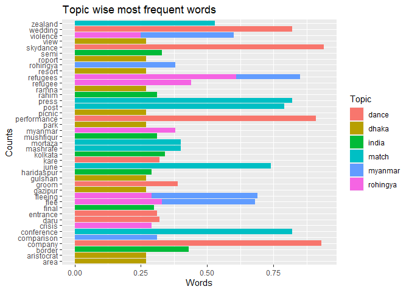<!-- -->

We have used different levels of correlations randing from 0.24 to 0.40
to restrict our correlated words less than 10 for each key word. Now we
have a clearer picture of how our most frequent words relate with other
words. Myanmar has come into the scenario mostly because of the issue of
[Rohingya crisis](https://www.cnn.com/specials/asia/rohingya) and
discussions related to India were related to border issues and cricket.
Dhaka’s, the capital of Bangladesh, correlation with words relatd to
area and parks may mean that the videos are mostly about the rcreational
areas around Dhaka.

We can also see that these words: *skydance*, *company*, *wedding*,
*performance* very highly correlate (above 0.90) with *dance*. Which
reveals that the videos are most likely about wedding dance from some
group called Skydance. Let’s look at the names of the channels that have
posted most numbers of videos which may give us some new insight.

``` r
videos_year %>% count(channelTitle) %>% arrange(desc(n)) %>%
  mutate(channelTitle = reorder(channelTitle, n)) %>% head(10) %>%
  ggplot(aes(channelTitle, n)) + 
  geom_col()  + 
  scale_x_discrete() +
  coord_flip() +
  ggtitle(label = 'Top 10 chennels with most video uploads') + 
  xlab(label = 'Channel name') + 
  ylab(label = 'Number of videos') +
  labs(fill = 'Ratio to the total video posted')
```

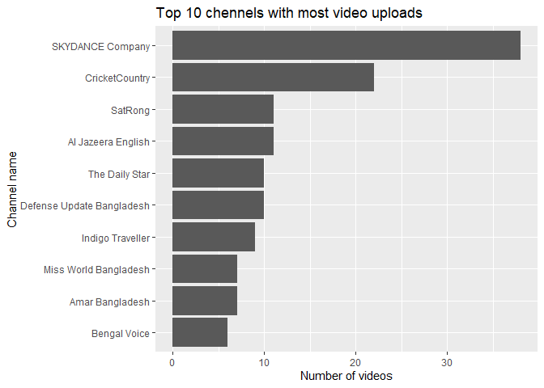<!-- -->

As we have assumed before, we can see that the channel named ‘Skydance
company’ posted the highest number of videos (more than 30) and their
high number of videos on wedding program has pushed the the words
‘dancing’, ‘wedding’, ‘performance’ to the list of most frequent
words.

Among the other top video posters, presence of two news channels (Al
Jazeera and Daily Star, a local one) shows that Bangladesh has got quite
a good coverage from the news agencies. It would have been nice to see
how Bangladesh is represented in these news videos but in this analysis
we won’t focus on news. Maybe this can be a future project to work on\!
But before moving further into the text mining area we will take a look
into the numbers of likes, dislikes and comments to find answers to some
of the questions that we asked at the beginning of our analysis: - What
are the most liked videos? - What are the most disliked videos? - And
which videos got most traction with the viewers through comments?

``` r
library(grid)
library(gridExtra)
```

    ## Warning: package 'gridExtra' was built under R version 4.0.3

``` r
p1=videos_year %>% arrange(desc(likeCount)) %>% head(10) %>%
    mutate(title = strtrim(title, 25)) %>%
  mutate(title = reorder(title,likeCount)) %>%
  ggplot(aes(title, likeCount)) + geom_col()+ xlab(label="")+ ggtitle(label = 'Top 10 most liked videos') +  theme(axis.text.x=element_text(angle=45,hjust=1))

p2=videos_year %>% arrange(desc(dislikeCount)) %>% head(10) %>% 
    mutate(title = strtrim(title, 25)) %>%
  mutate(title = reorder(title,dislikeCount)) %>%
  ggplot(aes(title, dislikeCount)) + geom_col()  +  xlab(label = "")+ ggtitle(label = 'Top 10 most disliked videos') + theme(axis.text.x=element_text(angle=45,hjust=1)) + 
  labs(caption = '* Video titles have been truncated')
  
grid.arrange(p1,p2, ncol = 2)
```

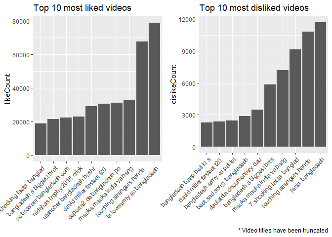<!-- -->

Interrestingly enough, looking at the lists of 10 most liked and
disliked videos we can see some common names\! Four out of the ten
videos are in the both list of highest liked and disliked videos.
Another interesting finding is that the videos with most likes and
disliked in the list are made in language other than *Bangla*, national
language of Bangladesh. From that it can be safely assumed that the
videos were created by non-Bangladeshi people.

Let’s dig deeper into the relationship between likes and dislikes. We
can look at the correlationship between likes and dislikes from a
scatter plot.

``` r
p1=videos_year %>%
  ggplot(aes(likeCount,dislikeCount)) +
  geom_jitter(alpha = 0.4, shape = 1) + 
  labs(subtitle = 'All records') +  
  xlab(label = 'Count of likes') + ylab(label = 'Count of dislikes')

quantile(videos_year$likeCount, na.rm = TRUE)
```

    ##      0%     25%     50%     75%    100% 
    ##     0.0    43.5   268.0  1241.0 78914.0

``` r
quantile(videos_year$dislikeCount, na.rm = TRUE)
```

    ##      0%     25%     50%     75%    100% 
    ##     0.0     4.0    32.0   136.5 11703.0

``` r
p2=videos_year %>% filter(likeCount <= 1241 & likeCount >= 44 & dislikeCount <= 137  & dislikeCount >= 4) %>%
  ggplot(aes(likeCount,dislikeCount)) +
  geom_jitter(alpha = 0.4, shape = 1) + 
  labs(subtitle = 'Both lowest and highest quantile values removed') +  
  xlab(label = 'Count of likes') + ylab(label = 'Count of dislikes')

grid.arrange(p1,p2, ncol = 2, top = 'Likes vs Dislikes')
```

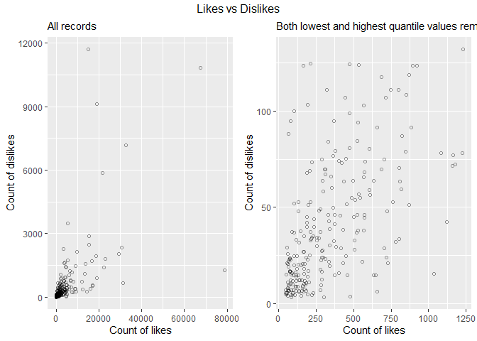<!-- -->

The left chart above represents all the videos. From the high density in
the bottom left corner, we can clearly see the high degree of skewness
in the data. Which means that there is high level of disparity among the
videos in terms of the number of likes and dislikes. Which is similar to
what we have observed in case of number of views.

So to overcome this clutter and derive more meaningful insight extreme
values from both the lowest and highest extremes (lowest and highest
quantile values) were considered only. Looking at the scatter plot in
right now we can observe a somewhat linearity can assumed between number
of likes and dislikes.Statistically which can be seen from their
correlation of 0.64. Which means in 64% of the cases high number of
likes co-occur with the high number of dislikes and vice versa.

Now let’s look at the number of comments.

``` r
videos_year %>% arrange(desc(commentCount)) %>% head(10) %>%
    mutate(title = strtrim(title, 25)) %>%
  mutate(title = reorder(title, commentCount)) %>%
  ggplot(aes(title, commentCount)) + geom_col()+ ggtitle(label = 'Top 10 most commented videos') +xlab(label="")+ coord_flip() + 
   theme(plot.title = element_text(hjust = -0.45, vjust=2.12)) +
  labs(caption = '* Video titles have been truncated')
```

<!-- -->

Looking at the most commented videos, as expected we can see some common
names from the previous charts on most viewed, liked and disliked
videos. But how does the relationship between comments and like or
dislike look like? Do people comment more when they like the video or
it’s opposite? To get an idea we will create consider ratio of like
versus dislike and plot it on top of comment chart.

``` r
videos_year = videos_year %>% mutate(like_dislike = round(likeCount/dislikeCount),2) 
videos_year %>% arrange(desc(commentCount)) %>% head(10) %>%
    mutate(title = strtrim(title, 25)) %>%
  mutate(title = reorder(title, commentCount)) %>%
  ggplot(aes(title, commentCount, fill = like_dislike)) + geom_col()+ xlab(label="")+ coord_flip() + ggtitle(label = 'Top 10 most commented videos with likes/dislike ratio') + 
  scale_fill_continuous("Likes to Dislikes") + 
  labs(caption = '* Video titles have been truncated')
```

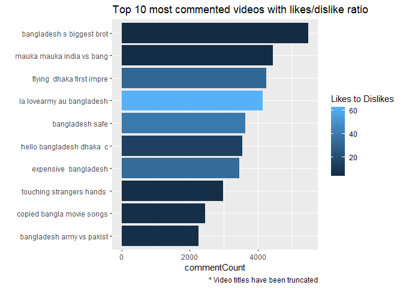<!-- -->

We can now immediately see the prevalence of extreme colors from both
end (dark or very light blue). Which means that majority of the top most
commented videos are either highly liked or extremely disliked
(extremely dark or extremely light blue color).

Let’s now check both likes and dislikes and their relationship with the
number of comments. To do that we will plot like and dislikes on a
scatter plot and color code count of comments categorized.

``` r
videos_year %>% filter(dislikeCount <3000 & likeCount <20000) %>%
  mutate(comment_cat = ifelse(commentCount <= 1000, '< or = 1000', 
                              ifelse(commentCount <= 2000, '1000 to 2000',
                                     ifelse(commentCount <= 3000, '2000 to 3000', 'above 3000')))) %>% drop_na() %>%
  ggplot(aes(likeCount, dislikeCount, color = comment_cat)) + 
  geom_point(size = 3,alpha = 0.4)  + 
  ggtitle(label = 'Likes vs Dislikes', subtitle = 'Videos with upper extreme values in likes and dislikes not considered') + 
  scale_fill_discrete(name = 'Comment count category')
```

<!-- -->

From the abundance of light red color on the above plot, we can
immediately see that there are not a lot of videos that could generate
more than 1000 comments. Anone take away from the plot is that videos
with higher likes compared to dislikes generates most number of
comments, above 3,000 (violet clor), while the videos with higher
dislikes compared to likes have total comments of no more than 1000.
Moreover, videos with both higher likes and dislikes generate moderately
high number of comments, 1,000 to 2,000 (light green). Higher
correlation between likes count and comment count (0.73) versus the
lower correlation between dislike count and comment count (0.58) also
reflects the possibility that video with higher likes tend to have
higher number of comments too.

``` r
cor(videos_year$likeCount, videos_year$commentCount, use = 'complete')
```

    ## [1] 0.7320702

``` r
cor(videos_year$dislikeCount, videos_year$commentCount, use = 'complete')
```

    ## [1] 0.5827611

At this stage of our analysis we can move onto analyzing the comments a
bit further. But due to restriction of the Youtube API on number of
records that can be collected, the comments will be collected for only
the selective videos. From our initial study on the video titles we have
already seen some common areas topics or areas were frequntly presented
such as *dhaka*, *india*, *rohingya*, *cricket* and *dance*. In the next
phase of our analysis we’ll look into these areas except the videos
related to *dance*, since we have already seen that these videos were
mostly posted by one channel with insignificant and also didn’t gather
much view.

To fetch comments of these selected topics, first of all all the videos
in our list have been classified under these four cateogories: cricket,
india, regugee, dhaka and dance. To do that total dataset has been
subseted using words those have high correlation with the ‘key words’
which are rohingya, india, dhaka, cricket and dance in this case. In the
next phase comments will be collected for the videos under these
categoris and sentiment analysis will be conducted to draw insight about
general sentiments expressed by the audiences around those topics.

``` r
videos_year=videos_year %>% 
  mutate(labels = ifelse(grepl(paste(c("rohingya",'refugee','flee','myanmar'), collapse = '|'),title), 'rohingya',
                         (ifelse(grepl("dhaka",title), 'dhaka',
                                 (ifelse(grepl('skydance',title), 'dance',
                                      (ifelse(grepl(paste(c("india",'border','kolkata'),collapse = '|'),title), 'india',
                                              ifelse(grepl(paste(c('cricket','press','post','conference'), collapse = "|"), title),'cricket',NA )))))))))

videos_year=videos_year %>% 
  mutate(labels = ifelse(grepl(paste(df1$words, collapse = '|'),title), 'rohingya',
                         (ifelse(grepl(paste(df2$words, collapse = '|'),title), 'dhaka',
                                 (ifelse(grepl('skydance',title), 'dance',
                                      (ifelse(grepl(paste(df4$words,collapse = '|'),title), 'india',
                                              ifelse(grepl(paste(df6$words, collapse = "|"), title),'cricket',NA )))))))))

summary(factor(videos_year$labels))
```

    ##  cricket    dance    dhaka    india rohingya     NA's 
    ##       23       38       15       22       36      455

Among our total 589 videos from our initial videos, we could make a
rough classification of 56 videos. We will further restrict the number
of videos to be considered for analysis by taking only the top 10
commented videos from each topic. So that we can still be within the
quota of the Youtube API.

``` r
# function to fetch comments of specific cateogry of video
fetchComments = function(dataset, keyword){
  df = dataset %>% filter(labels == keyword) %>% 
    arrange(desc(commentCount)) %>% head(10)
  comments = lapply(as.character(df$video_id), function(x){
    get_comment_threads(c(video_id = x), text_format = 'plainText')
  })
  comments = ldply(comments, data.frame) %>% select(videoId, textDisplay, likeCount, publishedAt)
  comments$textDisplay = as.character(comments$textDisplay)
  comments$label = keyword

  return(comments)
  
}


comment_rohingya = fetchComments(videos_year, 'rohingya')
comment_cricket = fetchComments(videos_year, 'cricket')
comment_dhaka = fetchComments(videos_year, 'dhaka')
comment_india = fetchComments(videos_year, 'india')

video_comments = rbind(comment_rohingya,comment_india,comment_dhaka,comment_cricket)
# write.csv(video_comments,'video_comments_top10videos_four_categories.csv', row.names = FALSE)
```

``` r
video_comments=read.csv('Data/video_comments_top10videos_four_categories.csv')
summary(video_comments$label)
```

    ##    Length     Class      Mode 
    ##      1990 character character

We can see that there are total 1,990 comments collected where most
comment generating video topics are rohingya, dhaka, cricket and india
in descending order. As we did with our previous dataset of
**videos\_year**, we will follow similar steps to clean the date and
text variables.

``` r
video_comments$publishedAt = as.Date(video_comments$publishedAt) 
video_comments= video_comments %>% mutate(tidy_date = floor_date(publishedAt, unit = "month"))
summary(video_comments$tidy_date)
```

    ##         Min.      1st Qu.       Median         Mean      3rd Qu.         Max. 
    ## "2017-02-01" "2017-09-01" "2017-11-01" "2017-11-25" "2018-03-01" "2018-07-01"

In this case in addition to converting the date column, *publishedAt*,
into proper date category, a new column of date has also been creted by
converting the date values in *publisheAt*. The new column
**tidy\_date** contains date values grouped into 12 groups containing
all dates clubbed under their respective month. For example, videos
posted on Feb-01, Feb-19 have been clubbed under Feb-01 and so on. From
the summary of this new variable above, we can see that we have records
from as early as February 2017 and as late as July 2018.

``` r
# cleaning comments
head(video_comments$textDisplay,5)
```

    ## [1] "Thank god for Aung San Suu Kyi for doing this.  I live in Yangon and I am so fed up with muslims acting like they own the world.  They are cowards who need to stop their terrorist attacks, or else more of this will happen."
    ## [2] "You know west is weak, when even the budhists show more balls dealing with islam."                                                                                                                                             
    ## [3] "Look out people. Evil George soros is using canadian government bob ray to make sure the slaughter continues"                                                                                                                  
    ## [4] "Humanity has no religion! Bhutanese cruel king n Indian Govt. sent more then 6 hundred thousand refugees to nepal in during 90s they r still in nepal . \nWelcome to nepal rohingya brothers n sister!!"                       
    ## [5] "George Soros is involved somewhere,i can smell his MO.  If you want real news go to UK Column news.(yt)"

``` r
video_comments$textDisplay <- iconv(video_comments$textDisplay, to = "ASCII", sub = " ") # convert to ASCII characters to remove any text written using anything other than plain english letter e.g. bengali words
video_comments$textDisplay= gsub("<.*?>","", video_comments$textDisplay) #removing html tags
video_comments$textDisplay= gsub("[[:punct:]]", " ", video_comments$textDisplay) #removing html tags
video_comments$textDisplay = gsub("[ |\t]{2,}", " ", video_comments$textDisplay)  # Remove tabs
video_comments$textDisplay = gsub("^ ", "", video_comments$textDisplay)  # Leading blanks
video_comments$textDisplay = gsub(" $", "", video_comments$textDisplay)  # Lagging blanks
video_comments$textDisplay = gsub(" +", " ", video_comments$textDisplay) # General spaces 
video_comments$textDisplay = tolower(video_comments$textDisplay) # lowering all letters
head(video_comments$textDisplay,5)
```

    ## [1] "thank god for aung san suu kyi for doing this i live in yangon and i am so fed up with muslims acting like they own the world they are cowards who need to stop their terrorist attacks or else more of this will happen"
    ## [2] "you know west is weak when even the budhists show more balls dealing with islam"                                                                                                                                         
    ## [3] "look out people evil george soros is using canadian government bob ray to make sure the slaughter continues"                                                                                                             
    ## [4] "humanity has no religion bhutanese cruel king n indian govt sent more then 6 hundred thousand refugees to nepal in during 90s they r still in nepal \nwelcome to nepal rohingya brothers n sister"                       
    ## [5] "george soros is involved somewhere i can smell his mo if you want real news go to uk column news yt"

``` r
# write.csv(video_comments,'cleaned_video_comments_top10videos_four_categories.csv', row.names = FALSE)
```

Now moving onto the text cleaning step for the *textDisplay* column we
have cleaned the html tags, lowered all letters, removed punctuation
marks. Above we can see sample of texts before the transformation and
after the transformation. The first five sentences in the above list
shows the text before cleaning steps applied and last five shows the
transforemd text after cleaning. Now we’ll calculate sentiment score for
each of the sentences using different lexicon libraries. For the
purpose, *tidytext* package will be used which offers the commonly used
lexicon libraries (bing, afinn, nrc).

Before moving into the analysis of sentiment scores we’ll take a look at
the trend of video posting. Naturally we expect to see videos in
different topics being posted at different rate over the period of
months.

``` r
# calculating labelwise trend of video posting
video_comments %>%
  group_by(tidy_date) %>%
  mutate(total_videos_month = n()) %>%
  ungroup() %>%
  count(tidy_date, label, total_videos_month) %>% 
  mutate(percent_video_label = n/total_videos_month) %>%
  ggplot(aes(tidy_date, percent_video_label, color = label, group = 1)) +         facet_wrap(~label)+ geom_line(size = 1) +
  scale_x_date(date_labels="%b %y",date_breaks  ="2 month") +    
  theme(axis.text.x=element_text(angle=45,hjust=1))+
  ggtitle(label = 'Month wise frequency of comments') + 
  xlab(label = 'Month') + 
  ylab(label = 'Percentage')
```

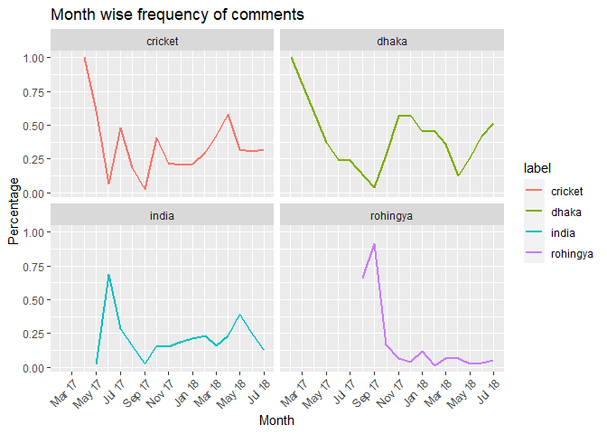<!-- -->

``` r
video_comments %>%
  group_by(tidy_date) %>%
  mutate(total_videos_month = n()) %>% # each row of video represent a single comment
  ungroup() %>%
  count(tidy_date, label, total_videos_month) %>% 
  mutate(percent_video_label = n/total_videos_month) %>%
  ggplot(aes(tidy_date, percent_video_label, color = label)) +         facet_wrap(~label)+ 
  geom_point(shape = 21, fill = "white", color = "#27408b", size = 2, stroke = 1.1)+
  geom_line(color="#27408b") +
  scale_x_date(date_labels="%b %y",date_breaks  ="2 month") +    
  theme(axis.text.x=element_text(angle=45,hjust=1))+
  ggtitle(label = 'Month wise frequency of comments') + 
  xlab(label = 'Month') + 
  ylab(label = 'Percentage')
```

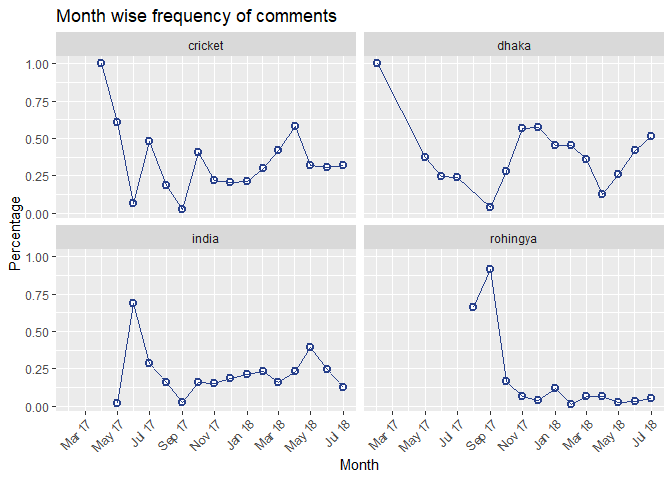<!-- -->

``` r
# video_comments %>% filter(tidy_date == '2017-06-01' & label == 'india') %>% select(videoId) %>% unique()
```

One nice thing about the plot above is that, it captures the trend how
social media activities spikes and then flattens with the time. For
example, the videos posted about *rohingya* topic had the highest
traction on September 2017 around the time when the crisis started. But
gradually comments have slowed down since November 2017. On the other
hand comments on videos about *cricket* and *india* show somewhat
resemblance. Till September 2017 both the topics experienced spikes or
in other words higher number of comments posted. Later on, the trend has
slowed down. We may now look at the trend from the perspective of age of
the videos. How did the sentiment of audiences of these videos changed
over the life time of the videos? Or does sentiment change as the videos
grow old?

``` r
# fetching video poblishing date from the old dataset
video_comments = video_comments %>% left_join(videos_year[,c('video_id','publishedAt')], by = c('videoId' = 'video_id'), suffix = c('_comment','_video')) 
# creating new variable with the difference between video posting date and comment posting date
video_comments = video_comments %>% 
  mutate(post_comm_gap = publishedAt_comment - publishedAt_video)

p1=video_comments %>%
  group_by(post_comm_gap) %>%
  mutate(total_videos = n()) %>%
  ungroup() %>% 
  ggplot(aes(post_comm_gap, total_videos)) +         
  facet_wrap(~label)+ geom_jitter() +
  theme(axis.text.x=element_text(angle=45,hjust=1))+
  labs(subtitle = 'All comments') + 
  xlab(label = 'Age of comment') + 
  ylab(label = 'Count')

p2=video_comments %>%
  group_by(post_comm_gap) %>%
  mutate(total_videos = n()) %>%
  ungroup() %>% 
  filter(total_videos < 20) %>%
  ggplot(aes(post_comm_gap, total_videos)) +         
  facet_wrap(~label)+ geom_jitter() +
  theme(axis.text.x=element_text(angle=45,hjust=1))+
  labs(subtitle = 'Less than 20 total comments') + 
  xlab(label = 'Age of comment') + 
  ylab(label = 'Count')

library(gridExtra)
grid.arrange(p1,p2, ncol = 2, top = 'Count of comments vs when they are posted')
```

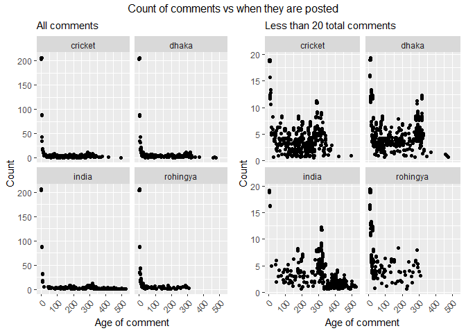<!-- -->

From left plot above, we can see that the highest number of comments are
posted right after videos are posted (where age of video is ‘zero’
meaning video posted and comment posted dates are same). But since we
can’t really make much sense out of the graphs because of the extremely
skewed data on y axis, we can consider only the lower values to check if
there is any specific trend. Doing that we ended up with the plot on
right. Where y axis with less than 20 values were considered.

From the right plot above, we can see that on an average number of
comments tend to slow down after 350 days from the date video posted but
comments on videos about *India* seemingly can keep this traction going
on further. While the videos about *Rohingya* issue doesn’t have any
comments after 300th days. Which largely because that the oldest video
considered here about *Rohingya* was posted on August 2017. Which barely
gives a life span of slightly more than 300 days While in other topics
there are videos from the very first month of 2007. But from the trend
of comments in other topics we can assume that the comments under the
existing videos about rohingya crisis may also take a gradual down turn
soon\!

Now moving on to the sentiment analysis, we’ll use lexicon based
approach. To do that we will look at the comments that viweres left
below these videos. We will calculate sentiment score using lexicon
library
[*NRC*](http://saifmohammad.com/WebPages/NRC-Emotion-Lexicon.htm). To
explain briefly what a lexicon is, lexicon libraries are stock of words
that are prelabeled with the sentiment that they carry. For example:
*happy* would be labeled as positive sentiment while *cry* as negative
sentiment. In The bing lexicon categorizes words in a binary fashion
into positive and negative categories.

``` r
# creating a new column with the words
video_comments$textDisplay = as.character(video_comments$textDisplay)
token = video_comments %>% 
  unnest_tokens(word, textDisplay, token = 'words', drop = FALSE) 

token %>% select(label, tidy_date, word) %>%
  inner_join(get_sentiments('nrc'), by = 'word') %>% 
  group_by(label,tidy_date) %>% 
  mutate(label_month_total = n()) %>%
  ungroup() %>%
  group_by(label,sentiment,tidy_date) %>%
  mutate(label_month_senti_total = n()) %>%
  ungroup() %>%
  mutate(percent_sentiment = label_month_senti_total/label_month_total) %>% select(label, tidy_date, sentiment, percent_sentiment) %>% unique() %>% 
  ggplot(aes(tidy_date, percent_sentiment, color = factor(sentiment))) + geom_line(size = 1) + facet_wrap(~label) + theme(axis.text.x=element_text(angle=45,hjust=1)) + 
  labs(title = 'Different sentiment trending over the time', x = 'Date', y = 'Percentage', colour = "Sentiments")
```

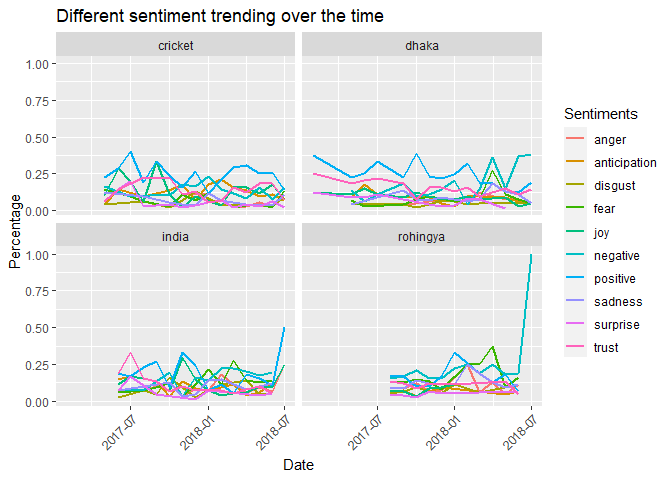<!-- -->

``` r
# nrc = get_sentiments('nrc')
# summary(factor(nrc$sentiment))
```

The plots above shows all the sentiments available in the *NRC lexicon*,
which presents an immediate challenge: too cluttered lines to
interprete. To make it legible we can club the negative and positive
sentiments and plot separtely. But before we do that, if we look back to
the plot and try to interprete the lines, we immediately see that there
is a prevalence of positive sentiment. Which is because of the nature of
the lexicon library. Majority of the words are classified or labeled as
positive words which is reflected in the above plot too.

``` r
p1 = token %>% select(label, tidy_date, word) %>%
  inner_join(get_sentiments('nrc'), by = 'word') %>% 
  filter(sentiment %in% c('anger','disgust','fear','sadness','negative')) %>%
  group_by(label,tidy_date) %>% 
  mutate(label_month_total = n()) %>%
  ungroup() %>%
  group_by(label,sentiment,tidy_date) %>%
  mutate(label_month_senti_total = n()) %>%
  ungroup() %>%
  mutate(percent_sentiment = label_month_senti_total/label_month_total) %>% select(label, tidy_date, sentiment, percent_sentiment) %>% unique() %>% 
  ggplot(aes(tidy_date, percent_sentiment, color = factor(sentiment))) + geom_line(size = 1) + facet_wrap(~label) + theme(axis.text.x=element_text(angle=45,hjust=1)) + 
  labs(title = 'Negative sentiments trending over the time', x = 'Date', y = 'Percentage', colour = "Sentiments") +
  scale_x_date(date_labels="%b %y",date_breaks  ="2 month") 

p2 = token %>% select(label, tidy_date, word) %>%
  inner_join(get_sentiments('nrc'), by = 'word') %>% 
  filter(!sentiment %in% c('anger','disgust','fear','sadness','negative')) %>%
  group_by(label,tidy_date) %>% 
  mutate(label_month_total = n()) %>%
  ungroup() %>%
  group_by(label,sentiment,tidy_date) %>%
  mutate(label_month_senti_total = n()) %>%
  ungroup() %>%
  mutate(percent_sentiment = label_month_senti_total/label_month_total) %>% select(label, tidy_date, sentiment, percent_sentiment) %>% unique() %>% 
  ggplot(aes(tidy_date, percent_sentiment, color = factor(sentiment))) + geom_line(size = 1) + facet_wrap(~label) + theme(axis.text.x=element_text(angle=45,hjust=1)) + 
  labs(title = 'Positive sentiments trending over the time', x = 'Date', y = 'Percentage', colour = "Sentiments")+
  scale_x_date(date_labels="%b %y",date_breaks  ="2 month") 

grid.arrange(p1,p2, ncol = 2)
```

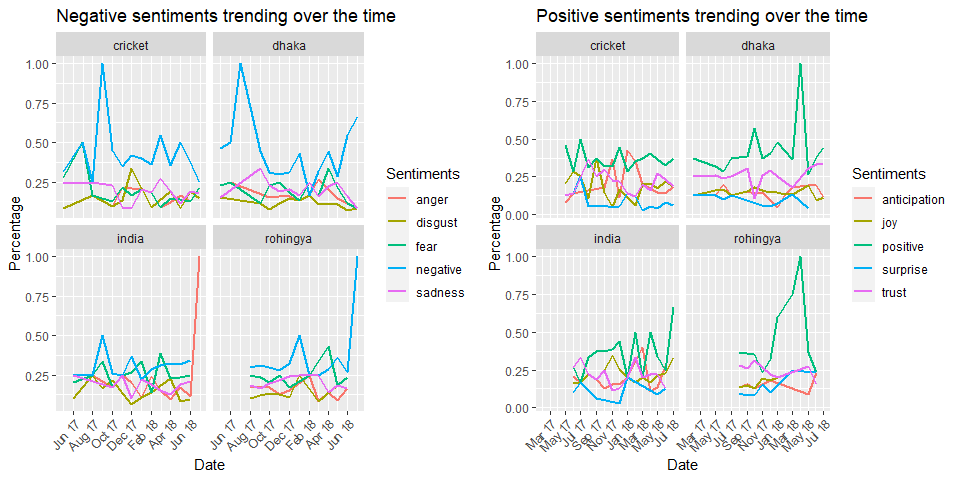<!-- -->

Looking at the left plot two interesting trends can be spotted: \* About
India there has been a sudden growth of *anger* during the months of
June and July 2018. \* On the other hand surprisingly negative sentiment
about the Rohingya issue is growing on the months of June and July 2018.

Plot on the right kind of reflects the sentiments expressed on the left
plot. Where we see a hightened positivity about Dhaka and Rohingya on
April 2018.

We are at the very end of our analysis. We will wrap it up with network
charts, created with the most frequent words (noun and adjectives), on
the comments about India and Rohingya in recent times (after June 2018).
From these plots we will try to make a sense about the areas where the
unusual spike of negative sentiments were expressed.

``` r
#key words extraction from the advising notes
ud_model = udpipe_download_model(language = 'english')
ud_model = udpipe_load_model(ud_model$file_model)

net_plot = function(dataset,label_name,sg) {
  text = dataset %>% filter(label == label_name)
  text = text %>% filter(publishedAt_comment > "2018-06-01")
  text = udpipe_annotate(ud_model, x = text$textDisplay)
  text = as.data.frame(text)
  text$lemma = removeWords(text$lemma, stopwords('english')) 
  text$lemma = removePunctuation(text$lemma) 
  text = text %>% filter(lemma != "")
  stat = cooccurrence(x = subset(text, upos %in% c('NOUN','ADJ')), term = 'lemma',
                      group = c("doc_id", "paragraph_id", "sentence_id"), skipgram = sg)
  wordnetwork <- head(stat,50)
  wordnetwork <- graph_from_data_frame(wordnetwork)
  plot = ggraph(wordnetwork, layout = "fr") +
    geom_edge_link(aes(width = cooc, edge_alpha = cooc), edge_colour = 'red') +
    geom_node_text(aes(label = name), col = "darkgreen", size = 4) +
    theme_graph(base_family = "Arial Narrow") +
    theme(legend.position = "none") +
    labs(title = 'Cooccurrent Nouns and Adjectives', 
         subtitle = label_name)
  return(plot)
}

# net_plot(video_comments, 'dhaka',2)
# net_plot(video_comments, 'cricket',2)
 
p1=net_plot(video_comments, 'rohingya',2)
p2=net_plot(video_comments, 'india',1)

grid.arrange(p1,p2,ncol = 2, top = 'Word networks')
```

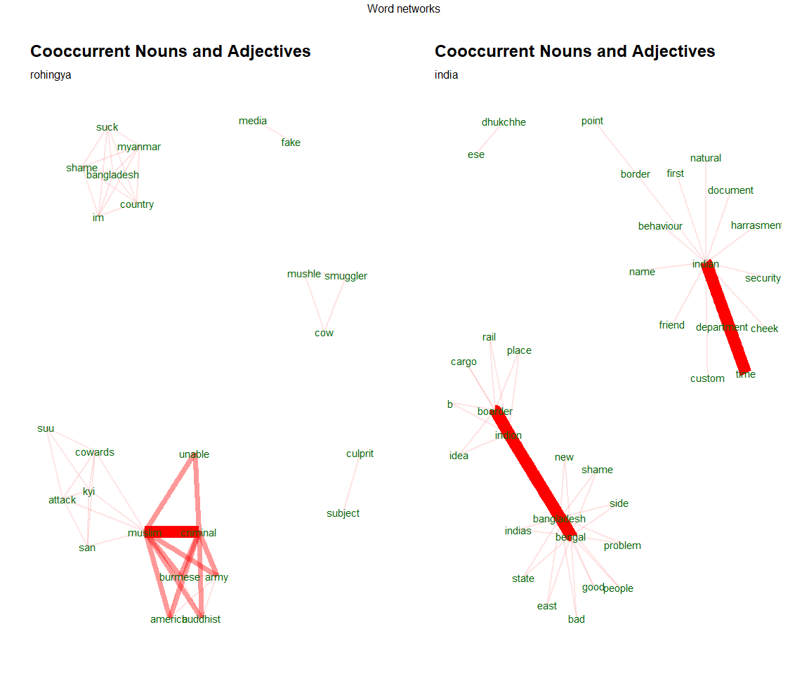<!-- -->

From the word network on left we observe that some most frequent phrases
are related to muslim such as muslim criminal, muslim burmese and so on.
From which it can be assumed that the negativity related to rohingya
issue is mostly about the plight of them which may have been triggered
by their muslim majority. On the other hand, most frequent phrases
around the topic of India are bangladesh border, bangladesh people and
so on. Where aparently no specific indication is present from which we
can make any assumption about the sudden increase of anger.

# Part 05: Ending

From our overall analysis, we have seen that videos with high number of
views tend to be about issues that evoke some sort of controverysy
(e.g. prank video and videos about brothel in top 20 videos).
Interestingly videos that generates higher number of likes also
generates higher shares of dislikes too (correlation of 0.6). And when
we consider comments as a matrix of viewer traction, most commented
videos tend to be on the extremes of likes or dislikes. But most liked
videos tend to have higher number of comments compared to the videos
with higher number of dislikes. Further we have observed that the videos
posted were mostly about some specific areas. From which we picked four
topics to explore further. The number of comments vary following
different trends in each of the topic areas. Where we have seen that
videos realted to *India* had the longest traction or kept generating
comments over a longer period of time. But overall videos seem to reach
their end of customer traction at around 350 to 400 days from the day
when they are first posted. In the end we looked at the sentiment
expressed in the comments by the viewers. Overall, we saw uneven
distribution of sentiments over the time. But for some reason we have
seen a prevalence of *anger* about the topic India and *negativity*
about the topic Rohingya in comments in recent time. And as a possible
source of recent increase in negative sentiment aroun rohingya topic we
indentified the plight of rohingya muslims.
